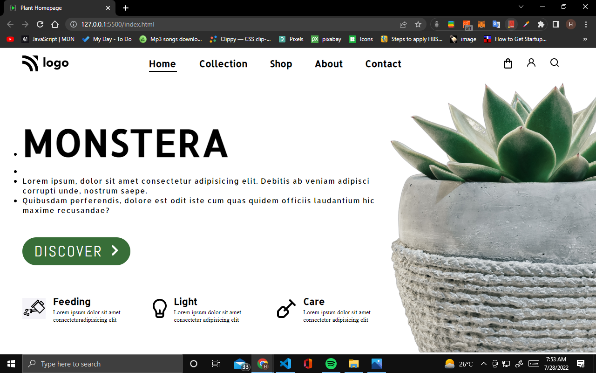

# Project 6 Plant Home  Page

## Hey there, I am Hitesh Pal

I have build this Plant Template with my core HTML CSS skills

You can check out the full version here: [Plant Home Page By Hitesh](https://plant-homepage-by-hitesh.netlify.app/)

## What i have learned from this project

    - In this project I have learned how to use HTML and css to this like templates.
    - How to use flex-box,grid and proper alignment of elements in the DOM.

## This project took me around 2:30 hours approximately.

### Connect with me 
[Twitter](https://twitter.com/HiteshP25522550) 
[Linkdin](https://www.linkedin.com/in/hitesh-pal-8379011ab/)
